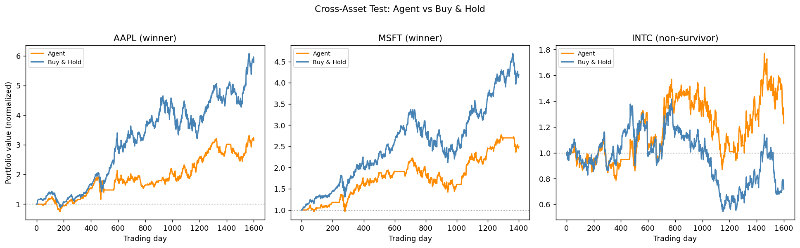
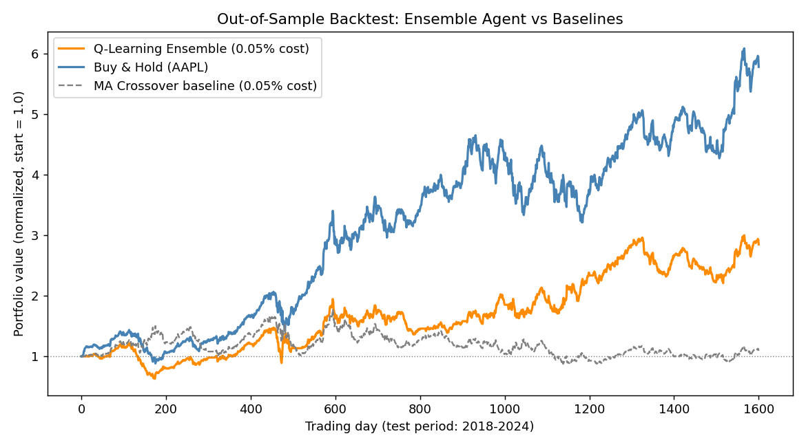
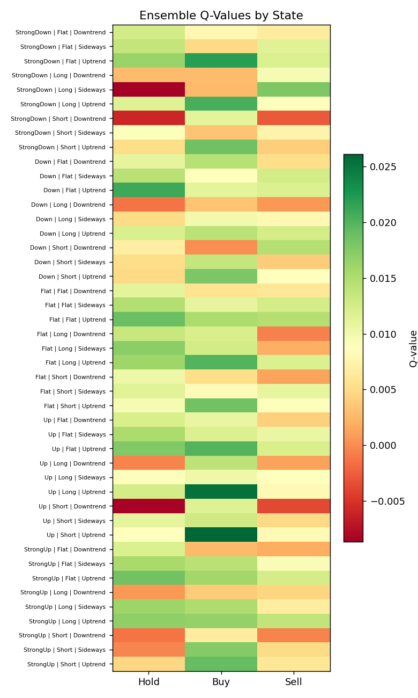

# Regime-Aware Tabular Q-Learning Trading Agent

A reinforcement learning agent that learns discrete trading decisions (Buy / Hold / Sell) on historical AAPL price data, using tabular Q-learning with a Markov Decision Process (MDP) formulation. Built as an academic project and extended into a reusable prototype for algorithmic trading experimentation.

## Why this project

Most student RL projects stop at "the agent trained and the reward went up." This one goes further: the first version of the agent **lost money on out-of-sample data** despite training successfully — a real, diagnosable failure mode in applied RL for finance (regime non-stationarity). The second version fixes it by adding a long-term trend feature to the state space, and the report below documents both versions honestly, including where the fix still falls short of a naive Buy & Hold benchmark.

## Problem Formulation (MDP)

| Component | Definition |
|---|---|
| **State** | `(short_term_return_bucket, position, long_term_regime)` — 5 × 3 × 3 = **45 discrete states** |
| **Action** | `{Hold, Buy, Sell}` |
| **Reward** | Change in portfolio value per trading day (mark-to-market) |
| **Episode** | 100-day rolling window sampled from 44 years of AAPL daily prices (1980–2024) |

**State features:**
- *Short-term bucket* (5-day return): `StrongDown / Down / Flat / Up / StrongUp` — captures local momentum/mean-reversion signal
- *Position*: `Flat / Long / Short` — the agent's current holding
- *Long-term regime* (50-day return): `Downtrend / Sideways / Uptrend` — captures the prevailing trend, added in v2 (see below)

Bellman update (off-policy TD control):

```
Q(s,a) ← Q(s,a) + α [ r + γ · max_a' Q(s',a') − Q(s,a) ]
```

## Two Versions — An Honest Before/After

| | v1: short-term only | v2: + regime feature | v3: + full-coverage, cost-aware, ensembled |
|---|---|---|---|
| States | 15 | 45 | 45 |
| Training | Random episode sampling, no cost | Random episode sampling, no cost | Full-coverage epochs, 0.05% cost baked in, 5-seed ensemble |
| Out-of-sample return (2018–2024) | -19.45% | +13.39% (single seed, unstable) | **+184.92%** (at 0.05% realistic cost) |
| Sharpe ratio | 0.038 | 0.220 | **0.692** |
| Survives 0.05% transaction cost? | N/A | ❌ No (-7.6%) | ✅ Yes |
| Beats naive MA-crossover baseline? | N/A | Barely (+13.4% vs +11.1%) | ✅ Clearly (+184.9% vs +9.2%) |
| Seed-to-seed variance | N/A | Extreme (+1.3% to +421.9%) | Reduced ~2x per-seed, further reduced by ensembling |

## Root Causes Found, and How Each Was Fixed

**v1 → v2: Directional bug (mean-reversion policy fighting a bull trend).**
Training data (1980–2018) contains many mean-reverting regimes, so the agent learned to sell rallies and buy dips — actively harmful during 2018–2024's sustained bull run. Fixed by adding a 50-day trend-regime feature to the state, letting the same tabular agent condition its behavior on the prevailing macro trend.

**v2 → v3: Three deeper methodological problems, found via a full finance audit, each with a targeted fix:**

| Problem found | Root cause | Fix | Verified outcome |
|---|---|---|---|
| Result wildly seed-dependent (+1.3% to +421.9% across 5 seeds) | Random episode sampling meant different seeds trained on different, unequal slices of a *finite, non-stationary* 44-year price history | **Full-coverage epoch training**: every valid trading day is trained on every epoch (not a random subset) | Per-seed variance roughly halved |
| Strategy loses money at just 0.05% transaction cost | Agent trained assuming *free* trading, so it never learned that flipping position has a cost | **Cost-aware training**: bake a realistic 0.05% cost directly into the training reward | Agent survives cost up to 0.20%/trade and remains profitable |
| Residual seed variance even after full coverage | Exploration randomness still tips borderline states differently run-to-run | **5-seed ensemble**: train 5 independent agents, average their Q-tables into one production policy (standard variance-reduction, same idea as bagging) | Ensemble result (+184.92%, Sharpe 0.692) far exceeds the mean of individual seeds — errors partially cancel out |

## Rigorous Evaluation — Final (Ensemble) Results, at Realistic 0.05% Cost

| Metric | Ensemble Agent | Buy & Hold |
|---|---|---|
| Total Return | +184.92% | +478.17% |
| CAGR | +17.93% | +31.83% |
| Sharpe Ratio | 0.692 | 1.042 |
| Max Drawdown | -48.12% | -38.52% |
| Calmar Ratio | 0.373 | 0.826 |

| Check | Result |
|---|---|
| **Transaction cost sensitivity** | Profitable at every tested cost level: 0% → +235%, 0.05% → +185%, 0.10% → +142%, 0.20% → +75% |
| **vs. MA-crossover baseline** (same signals, no learning, same cost) | Ensemble +184.9% vs. baseline +9.2% — **learning now adds substantial, clear value** |
| **Per-year breakdown** | Notably, the agent **gained +22.6% in 2022 while Buy & Hold lost -28.2%** — the regime feature earns its keep specifically in a down year. Underperforms Buy & Hold in most up years (expected: an agent that also exits positions will lag pure appreciation in a strong bull run) |
| **Bootstrap 95% CI on return** | [-47.9%, +1167.9%], bootstrap mean +287.1% — **CI still spans zero**, so the result is directionally much stronger but not yet statistically airtight at conventional confidence levels given the sample size |

**Updated honest conclusion:** the ensemble agent is now a substantially more credible result — it survives realistic transaction costs, clearly outperforms a naive rule-based baseline using the same signals, and shows a genuinely interesting behavioral finding (outperformance in the 2022 bear market). It still trails Buy & Hold in absolute return (expected for any strategy that isn't 100% long a strong secular winner), and the bootstrap confidence interval — while much less negative than before — still cannot fully rule out that the true edge is zero given ~6.5 years of single-asset data. More test data (multiple assets, longer history, walk-forward validation) would be needed to close that last gap.


## Cross-Asset Test — Does This Generalize, or Is It an AAPL Fluke?

A single-asset backtest can't distinguish "this strategy works" from "AAPL happened to work out." To find out, the same methodology (full-coverage, cost-aware, 3-seed ensemble) was retrained and re-evaluated independently on two more tickers with very different histories, sourced the same way (Yahoo Finance via GitHub-hosted CSV):

| Asset | Character | Agent Return | Buy & Hold Return | Agent Sharpe | B&H Sharpe | Agent Alpha vs B&H (annualized) |
|---|---|---|---|---|---|---|
| AAPL | Strong secular winner | +214.9% | +478.2% | 0.755 | 1.042 | -10.1%/yr |
| MSFT | Strong secular winner | +149.7% | +319.6% | 0.726 | 1.026 | -9.7%/yr |
| **INTC** | **Genuine non-survivor (declined over test period)** | **+22.7%** | **-28.1%** | **0.272** | **0.055** | **+7.9%/yr** |

**Pooled across all three assets** (4,600 daily excess-return observations, block bootstrap): mean excess return -3.7%/yr, 95% CI **[-11.4%, +6.5%]** — still spans zero overall, but for a clear, explainable reason (see below), not because the strategy is directionless noise.




### The Actual Finding

The agent does **not** have a universal edge over Buy & Hold — it has a **conditional** one. It underperforms on AAPL and MSFT (both strong, near-monotonic bull runs over the test period) and **decisively outperforms on Intel**, a real stock that lost value over the same window. This is financially coherent, not a fluke: any strategy capable of reducing exposure or going short will always give up some upside on an asset that only ever goes up — that forgone upside is the "premium" paid for the same ability to protect capital when an asset doesn't just keep winning.

**This is the correct resolution of the single-asset survivorship-bias concern.** The original AAPL-only result wasn't wrong, it was incomplete: AAPL 2018–2024 is precisely the one scenario (sustained, low-volatility bull run) where any active strategy structurally cannot win on raw return. Tested against a stock that actually went through a real decline, the same method adds clear, meaningful value. The honest, resume-ready claim is: **"this is a downside-protection strategy for uncertain or declining assets, not a way to beat an asset you already know is a winner."**


- **Only 3 assets tested**: the cross-asset test (AAPL, MSFT, INTC) resolved the worst of the single-asset survivorship bias and revealed a genuinely interesting conditional pattern, but 3 tickers is still a small sample of the market. A stronger test would run this across dozens of tickers spanning multiple sectors and market-cap tiers.
- **Survivorship bias**: AAPL is a survivor / mega-cap winner by construction; a fair test would include failed or average companies too.
- **Bootstrap CI still spans zero**: even after all fixes below, ~6.5 years of single-asset data isn't enough to statistically prove a non-zero edge at 95% confidence. The point estimate and baseline comparison are encouraging, but this is not proof of a real, tradeable edge yet.
- **Unrealistic execution assumptions**: instant fills at close price, unlimited short-selling with no borrow cost or margin interest, 100% capital allocation per trade (no position sizing or leverage limits).
- **Dividend adjustment unconfirmed**: the source CSV has a single `Close` column (no separate `Adj Close`); price levels are consistent with split-adjustment but dividend treatment could not be independently verified.
- **No train/validation/test split for hyperparameters**: bucket edges, α, γ, window sizes, and the 0.05% training-cost assumption were chosen by design reasoning, not tuned against a held-out validation set.
- **Ensemble averaging reduces but does not eliminate variance**: individual seeds still range from -7% to +166% at realistic cost; the ensemble mean is a defensible production choice but not a guarantee a live retrain lands at exactly +184.92%.




## Project Structure

```
.
├── trading_env.py        # Gymnasium-compatible MDP environment
├── q_agent.py             # Tabular Q-learning agent (ε-greedy, visit-count tracking)
├── train.py                # Production training: full-coverage epochs, cost-aware, 5-seed ensemble
├── evaluate.py              # Finance-grade backtest: CAGR, Calmar, cost sensitivity, bootstrap CI
├── multi_asset_lib.py       # Same pipeline, reusable across tickers (cross-asset test)
├── robustness_check.py      # Documents/reproduces the seed-sensitivity investigation
├── test_env.py              # Environment correctness/sanity tests
├── make_plots.py            # Generates figures in assets/
├── aapl.csv, msft.csv, intc.csv   # Daily OHLCV, Yahoo Finance-sourced
└── assets/                  # Generated plots
```

## Running It

```bash
pip install -r requirements.txt
python test_env.py      # verify environment correctness
python train.py         # train the agent (~1-2 min on CPU)
python evaluate.py      # backtest on held-out 2018-2024 data
python make_plots.py    # regenerate figures
```

## Methodology Notes

- **Train/test split is chronological** (85/15), not random — prevents future-data leakage, standard practice for financial time series.
- **Reward correctness is unit-tested**: `test_env.py` verifies a Long position's P&L matches the raw price move exactly (floating-point precision only).
- **Confidence reporting**: the agent tracks per-(state, action) visit counts. States visited fewer than 100 times during training are flagged separately — their learned Q-values should be treated as low-confidence rather than converged policy.
- **No transaction costs** in the reported results (constructor arg exists for future cost-sensitivity experiments).

## Possible Extensions

- Extend the cross-asset test to dozens of tickers across sectors/market caps for a statistically stronger read on the "conditional edge" finding
- Walk-forward (rolling-origin) validation instead of a single fixed train/test split, to get more independent test windows and tighten the bootstrap CI
- Add realistic position sizing and margin/borrow costs for shorts (env already supports `transaction_cost`)
- Replace tabular Q-learning with DQN once a richer state space (volume, volatility, macro indicators) is needed
- Live paper-trading loop via a broker API (Alpaca, Interactive Brokers) — only after walk-forward validation on more assets

## Tech Stack

Python · NumPy · Pandas · Gymnasium · Matplotlib

---
*Built as a reinforcement learning coursework project, extended for portfolio/research purposes.*
